## 1 - Identificação
- Universidade: Universidade Europeia  ;
- Faculdade: IADE ;
- Elementos do grupo: Rodrigo Canto, Rodrigo Daibert, Marco Fonseca e Daniel Paulo  ;
- Nome do projeto: NextBid  ;
- Repositório GitHub: https://github.com/rodrigocanto05/NextBid  ;
  
---

## 2 - Introdução
Após a fase de pesquisa e definição de requisitos (Fase I), o projeto **NextBid** avançou para a sua segunda etapa: Ideação e Prototipagem. Esta fase marca a transição da concetualização para a materialização técnica e visual da plataforma de leilões online.

O foco central desta etapa consistiu em desenhar a experiência do utilizador (UI/UX), estruturar a arquitetura de informação e iniciar a implementação da versão "Alfa" do projeto. O objetivo foi estabelecer uma infraestrutura de backend sólida, capaz de suportar as funcionalidades essenciais (core), e integrá-la com um frontend inicial, garantindo que o fluxo de dados entre o cliente e o servidor opera de forma eficiente.

A solução baseia-se numa separação clara entre frontend e backend, garantindo modularidade e escalabilidade. O sistema permite aos utilizadores interagir com dados dinâmicos, sendo estes processados no servidor e posteriormente apresentados na interface.

---
## 3 - Objetivos da Fase II
- Elaborar em UML os Casos de Uso e o Modelo de Domínio do sistema.
- Desenvolver os Mockups de alta fidelidade e interfaces na plataforma Figma.
- Criar e documentar os UI Assets e o Web Design System da plataforma.
- Implementar a infraestrutura de backend (PHP e Base de Dados) para as funcionalidades core.
- Desenvolver a versão Alfa/Protótipo do projeto, validando a integração Frontend ↔ Backend.
- Validar a Arquitetura de Informação através de testes com utilizadores.
  
---

## 4 - Descrição da Solução

O **NextBid** consiste numa aplicação web que permite a criação, gestão e participação em leilões online, integrando múltiplos componentes técnicos que trabalham de forma interligada.

A solução baseia-se numa separação clara entre frontend e backend, garantindo modularidade e escalabilidade. O sistema permite aos utilizadores interagir com dados em tempo real, sendo estes processados no servidor e posteriormente apresentados na interface.

O principal objetivo é garantir não só o funcionamento do sistema de leilões, mas também uma experiência interativa suportada por dados dinâmicos e integração com funcionalidades adicionais.

---

## 5- Funcionalidades Core

Foram definidas e parcialmente implementadas funcionalidades essenciais que garantem o funcionamento do sistema:

- **Sistema de autenticação de utilizadores**: Registo e login de utilizadores com encriptação de dados.
- **Caça ao tesouro**
- **Criação e gestão de leilões (CRUD)**: Capacidade de listar produtos e leilões armazenados na BD.
- **Sistema de licitação com validação de valores**: Comunicação assíncrona entre cliente e servidor para submissão de valores.
- **Comunicação entre frontend e backend através de HTTP requests**: Comunicação de forma dinâmica entre o frontend e o backend
- **Atualização dinâmica da interface com base nos dados recebidos**:Todos os dados adquiridos no frontend são prontamente guardados na base de dados

Estas funcionalidades asseguram que o utilizador consegue completar o fluxo principal da aplicação, desde a consulta até à interação com leilões.

---

## 5.1 - Funcionalidades Secundárias

Para complementar o sistema, foram também definidas funcionalidades adicionais:

- **Caça ao Tesouro & Integração de Mapas (SIG)**: Infraestrutura preparada para receber coordenadas geográficas (preparação para o Leaflet.js).
- **Dashboard com informação estatística**: Base de dados recolhe presentemente dados suficientes para análise estatística futura (ex: média de valores de lances).
- **Sistema de notificações**: Notificações em tempo real para atualização para a gamificação referente a caça ao tesouro.

Estas funcionalidades aumentam o valor da aplicação, mas não são críticas para o funcionamento base.

---

## 6 - Arquitetura de Informação

A arquitetura de informação foi estruturada com base na organização do conteúdo, nas necessidades do utilizador e no contexto de utilização.
A estrutura do sistema foi definida de forma hierárquica, incluindo:

- Página inicial com listagem de leilões
- Página de detalhe de leilão
- Área de autenticação
- Perfil de utilizador

Foi desenvolvido um mapa de navegação visual que permite validar a coerência das secções e identificar os caminhos possíveis (User Flows) dentro do sistema.

---

## 7 - Mapa de Navegação

Foi desenvolvido um mapa de navegação que representa a estrutura da aplicação e os caminhos possíveis do utilizador dentro do sistema.

Este mapa permite:
- Visualizar a hierarquia das páginas
- Identificar relações entre diferentes secções
- Validar a coerência da navegação

A estrutura final ficou organizada em torno do leilão como entidade central:

```
Homepage
├── Leilões
│   └── Detalhe de leilão  →  licitar · chat · atributos
├── Mapa / Caça ao Tesouro
├── Perfil
│   ├── Os meus leilões
│   ├── Carteira
│   └── XP & Leaderboard
└── Autenticação  (login · registo)
```

### 7.1 - User Tasks

As tarefas centrais foram definidas com base nos objetivos primários de cada perfil de utilizador.

**Comprador**
- Explorar leilões disponíveis (categoria, localização)
- Visualizar detalhe e histórico de licitações
- Licitar e acompanhar o estado em tempo real
- Receber notificação ao ser ultrapassado
- Gerir carteira (consulta e depósito)
- Reclamar recompensas de caça ao tesouro

**Vendedor**
- Criar novo leilão (imagens, atributos, localização)
- Acompanhar leilões ativos
- Cancelar leilão sem licitações
- Consultar avaliações recebidas

**Geral**
- Registar conta e autenticar
- Editar perfil
- Consultar XP e posição no leaderboard
- Enviar mensagem no chat de um leilão
- Avaliar vendedor após conclusão de leilão

### 7.2 - User Flows

Foram desenhados os fluxos críticos do sistema. O principal — participação em leilão:

```
Homepage → Filtro (categoria/GPS) → Detalhe → Verificar saldo
   → (depositar se necessário) → Licitar → Notificação
   → Fecho automático por timer → Vitória / Outbid
```

Fluxo alternativo — caça ao tesouro:

```
Mapa → Filtro por raio GPS → Detalhe do evento
   → Participar → Validação (GPS ou QR) → XP atribuído → Leaderboard atualizado
```

Fluxo de criação de leilão (vendedor):

```
Perfil → Os Meus Leilões → Criar
   → Formulário (título, categoria, preço) → Upload imagens (3–15)
   → Atributos dinâmicos → Duração → GPS → Submeter
```

### 7.3 - Wireframes

Foram desenvolvidos seis wireframes de baixa fidelidade que estabeleceram a estrutura antes da prototipagem visual. Disponíveis em [`wireframes/`](wireframes/).

**Homepage**
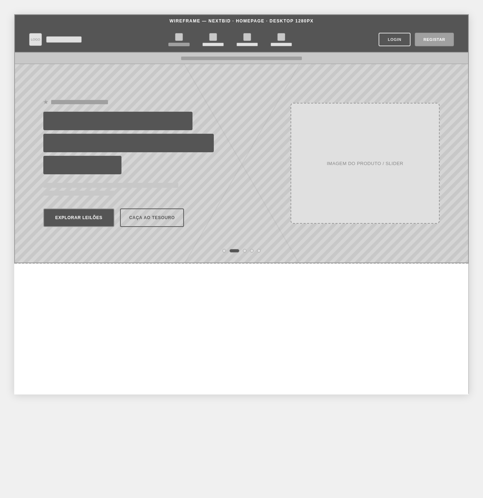

**Listagem de Leilões**
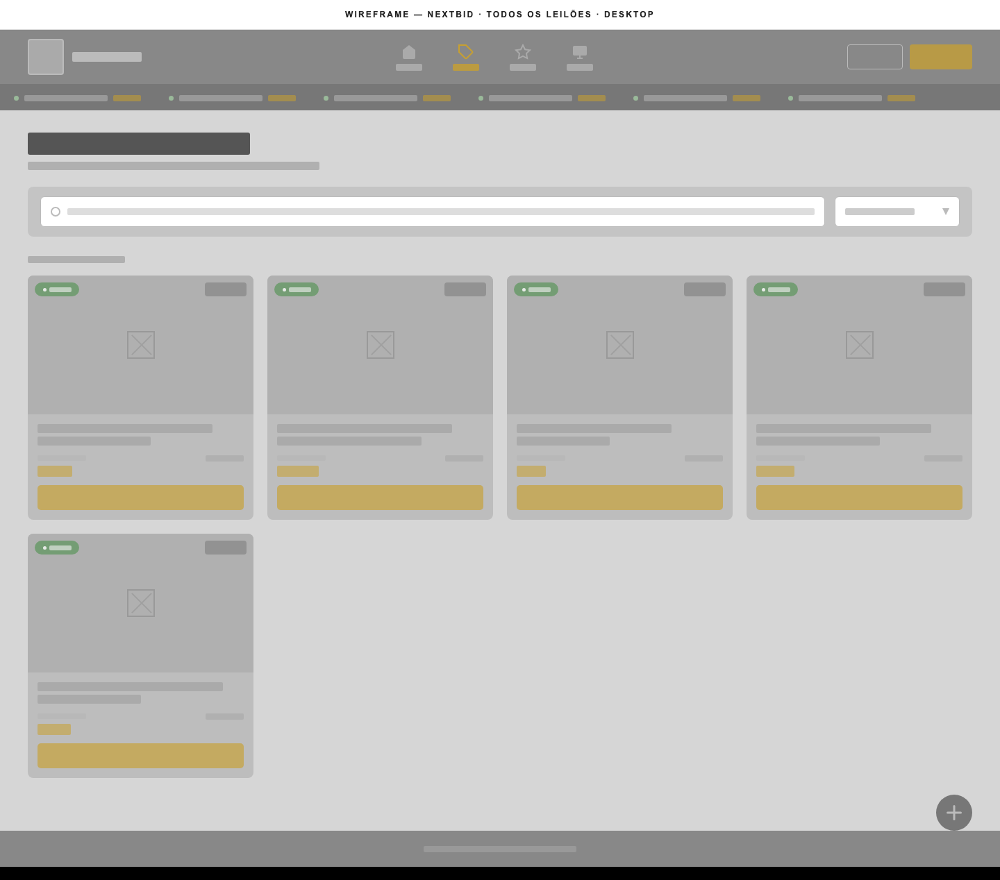

**Detalhe de Leilão**
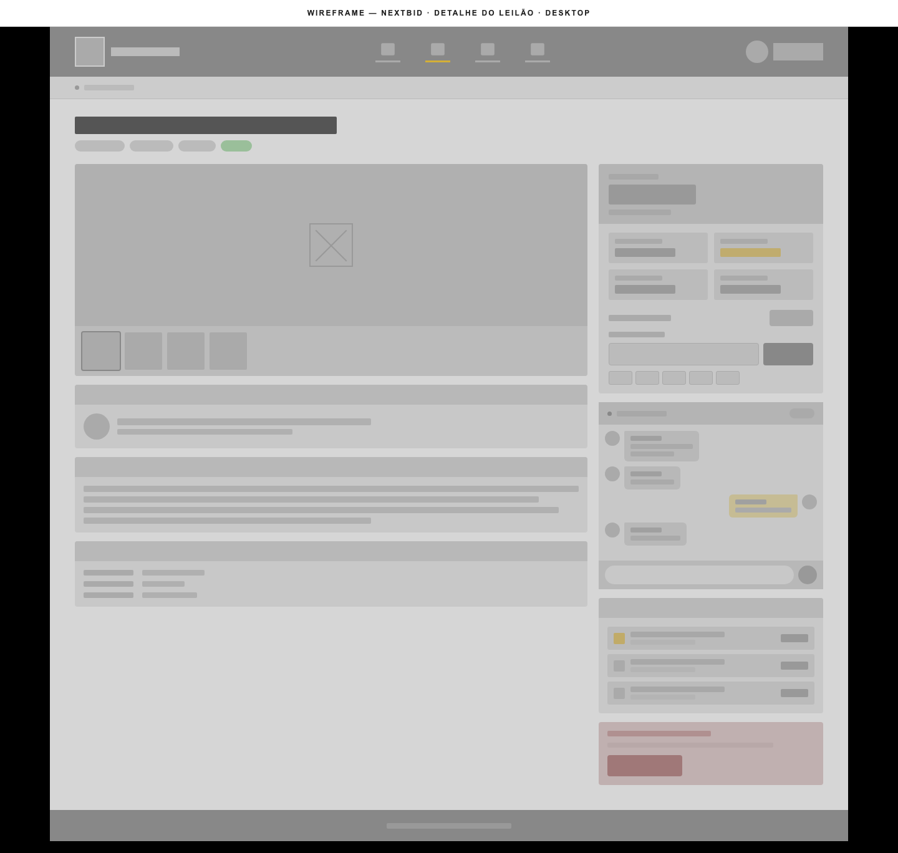

**Perfil de Utilizador**


**Os Meus Leilões**


**Mapa / Caça ao Tesouro**
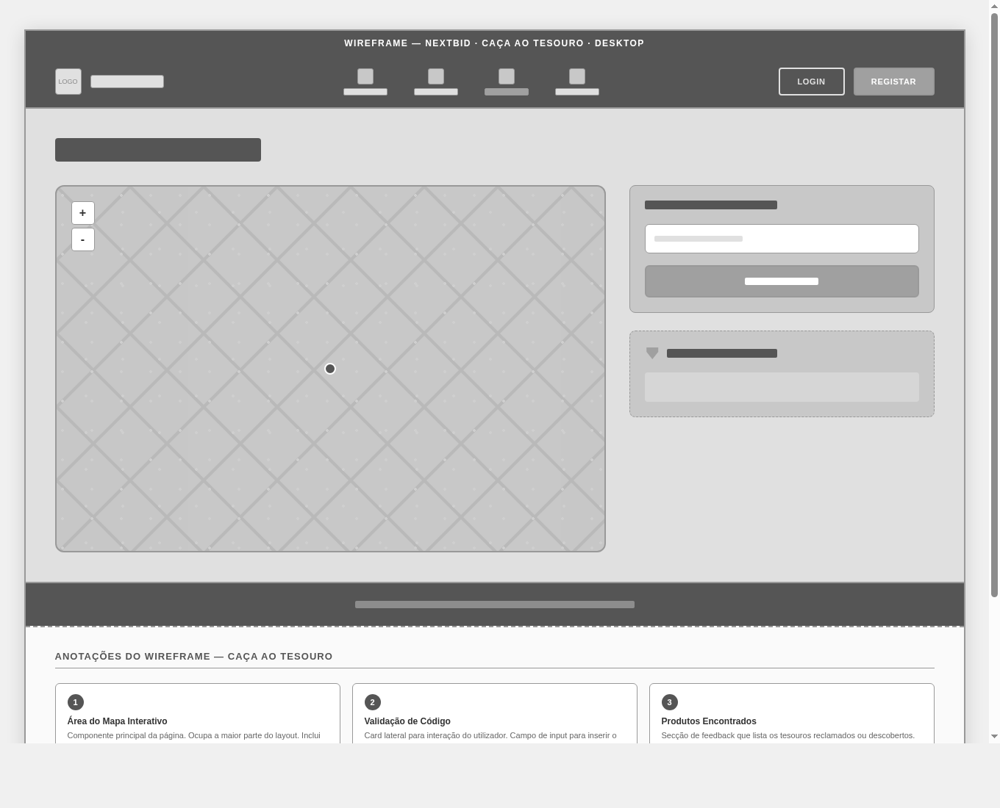

---

## 8 - Tree Testing

- A validação desta arquitetura foi realizada através da técnica de Tree Testing, permitindo testar a capacidade de os utilizadores encontrarem
- funcionalidades com base apenas na estrutura de navegação. Este processo permitiu:
- Identificar inconsistências na organização e nomenclatura dos menus.
- Ajustar a estrutura de navegação para reduzir o número de cliques até ações essenciais.
- Garantir uma usabilidade intuitiva para diferentes perfis de público-alvo.

Este processo permitiu:
- Identificar inconsistências na organização
- Ajustar a estrutura de navegação
- Garantir maior usabilidade do sistema

---

## 9 - Modelação do Sistema (UML)

De forma a garantir uma lógica de negócio robusta e bem documentada, procedeu-se à modelação do sistema recorrendo a diagramas UML, traduzindo as regras definidas na Fase I para esquemas técnicos:

- Casos de Uso: Mapeamento de todas as interações possíveis dos diferentes atores (Visitante, Utilizador Autenticado, Administrador) com a plataforma, tais como "Registar Conta", "Licitar em Leilão", "Consultar Mapa de Tesouros" e "Gerir Leilões".

- Modelo de Domínio: Estruturação das entidades do sistema (Utilizadores, Produtos, Leilões, Licitações, Recompensas) e das respetivas relações e multiplicidades, servindo de base direta para a implementação do esquema da base de dados relacional.

### 9.1 - Atores

- **Visitante** — utilizador não autenticado; pode consultar leilões ativos e o mapa.
- **Utilizador Autenticado** — pode licitar, criar leilões, participar na caça ao tesouro e gerir carteira e perfil.
- **Administrador** — acesso total ao sistema; gere categorias e cria eventos de gamificação.

### 9.2 - Casos de Uso por Módulo

- **Autenticação** — registar conta (≥ 18 anos), iniciar/terminar sessão (única ou todos os dispositivos)
- **Leilões** — criar, listar (filtro GPS), ver detalhe, licitar, cancelar, consultar ganhos
- **Carteira** — consultar saldo, depositar, ver histórico de transações
- **Caça ao Tesouro** — explorar pontos no mapa, participar, reclamar por GPS ou código QR, ver conquistas
- **Perfil** — editar dados, consultar XP e nível, leaderboard, avaliar vendedor
- **Comunicação** — chat por leilão, notificações
- **Administração** — gestão de categorias e criação de eventos de gamificação

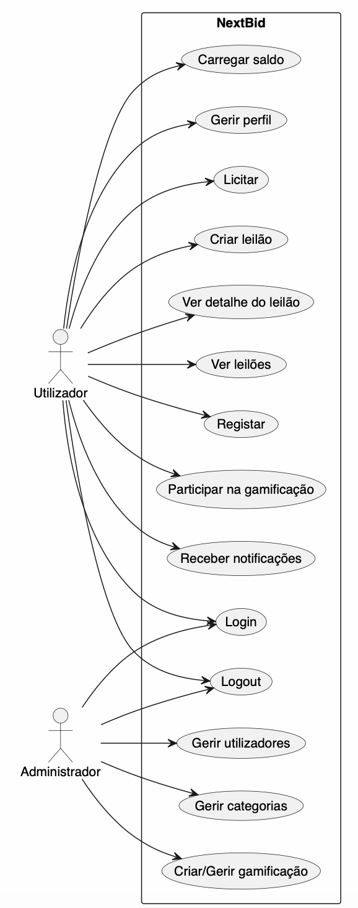

### 9.3 - Modelo de Domínio — Entidades

Entidades centrais e a sua função no sistema:

- `User` — utilizadores registados (role admin/normaluser, saldo, perfil)
- `Product` — leilões (preço, status, GPS, duração)
- `Bid` — licitações
- `Transaction` — movimentos da carteira interna
- `Category`, `ProductAttribute`, `ProductImage` — categorização e atributos do leilão
- `Gamification`, `GamificationClaim` — eventos de caça ao tesouro
- `XPLog`, `XPLevel` — sistema de progressão
- `Notification`, `Review`, `AuthToken` — alertas, avaliações e sessão

O modelo físico completo (schema, tipos e relações) está documentado em [`relatório_BD.md`](relat%C3%B3rio_BD.md).

---

## 10 - UI/UX, Mockups e Design System

A vertente visual da aplicação foi desenvolvida com foco em elevados critérios de usabilidade, visando maximizar a experiência do utilizador.

### 10.1 - Design System e UI Assets

Foi concebido um Design System coeso no Figma, adaptado a partir de uma base community para a identidade NextBid. Define tipografia, paleta, espaçamento (grid de 8 px), iconografia e os componentes reutilizáveis abaixo.

> **Figma →** [Design System NextBid](https://www.figma.com/design/pgCvU0DvI50EcrGyFTnkmz/Design-System--Community-?node-id=4-6)

- **Tipografia e Paleta de Cores** — cores de destaque para ações críticas (ex.: botão de licitação) e tons neutros para leitura confortável.
- **Componentes Reutilizáveis** — Product Card, Bid Panel, Navigation Bar, Form Inputs, Modals, Notification Badge, XP Progress Bar, Star Rating, Avatar, Map Markers (leilão e ponto de tesouro).

### 10.2 - Mockups de Alta Fidelidade

Foram desenhados os ecrãs principais da plataforma, representando fielmente o produto final. Disponíveis em [`Mockupsnextbid/`](Mockupsnextbid/).

**Homepage** — leilões em destaque e contadores decrescentes.


**Listagem de Leilões**

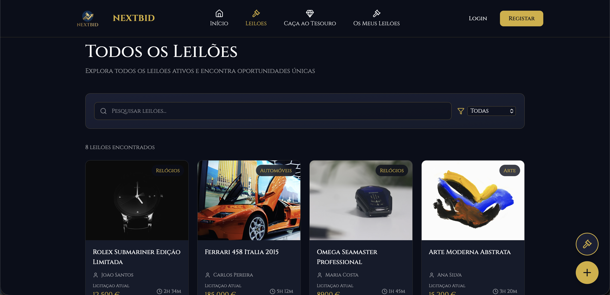

**Página detalhada do leilão** — histórico de lances, informações do produto, atributos e chat.
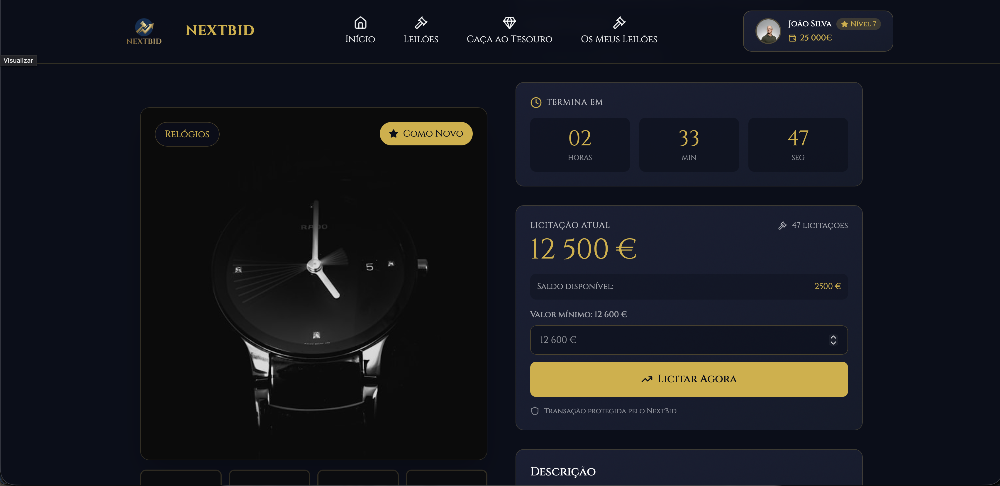
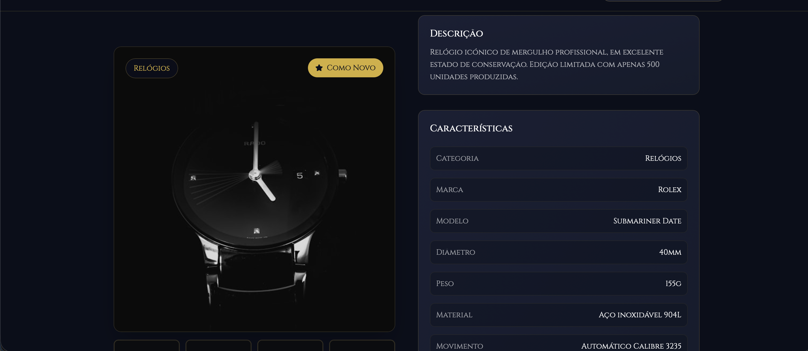
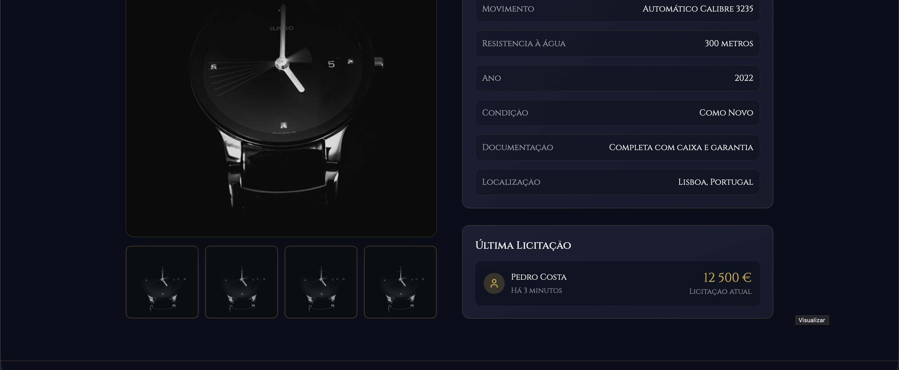

**Dashboard / Perfil do Utilizador**
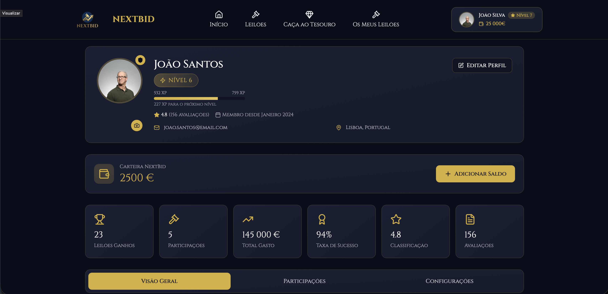
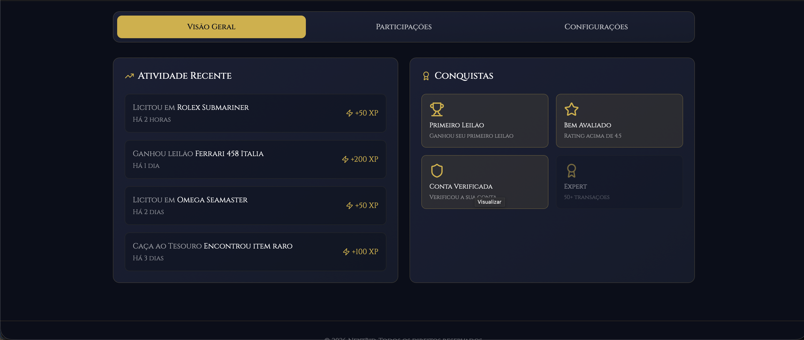
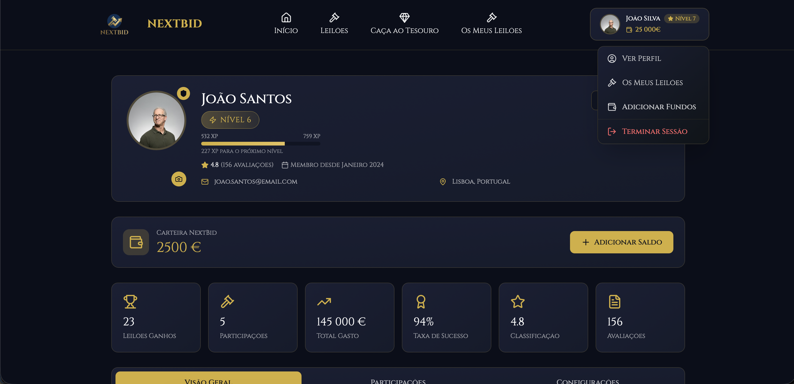

**Os Meus Leilões**
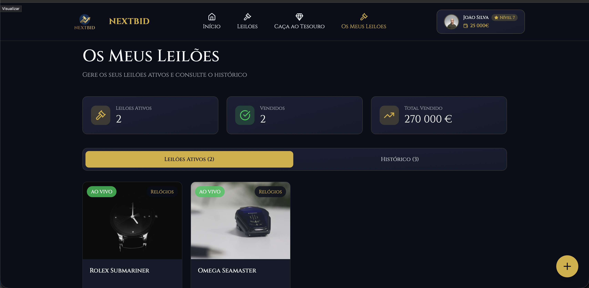

**Carteira**
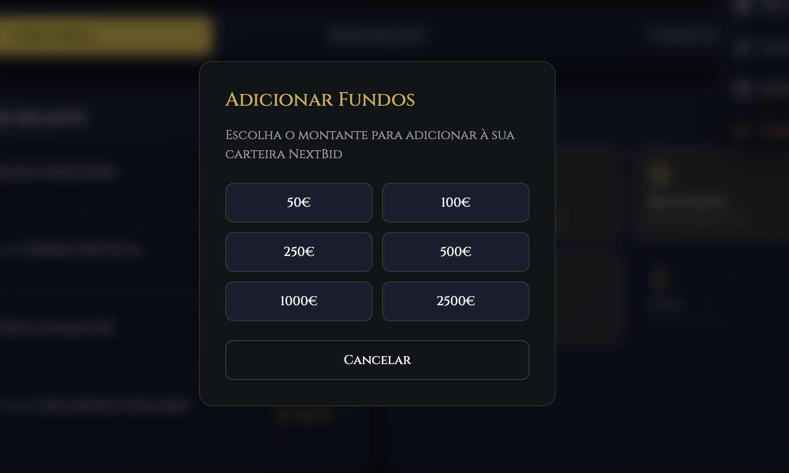

**Interface do Mapa interativo para a Caça ao Tesouro**


---

## 11 - Integração Backend ↔ Frontend

Durante esta fase, foi implementada a base da comunicação entre frontend e backend, garantindo o fluxo de dados no sistema.

### 11.1 - Backend (Servidor e API)
- Tecnologia: Desenvolvido em PHP assente num servidor local (XAMPP/MAMP).

- Base de Dados: Implementação do esquema físico numa base de dados relacional (MySQL).

- Lógica e API REST: Criação de endpoints que processam requests HTTP (GET, POST), realizam a comunicação com a base de dados (PDO) e devolvem as respostas estruturadas em formato JSON

### 11.2 - Frontend
- Tecnologia: HTML5, CSS3 e Vanilla JavaScript.

- Consumo de Dados: Utilização da Fetch API (AJAX) para consumir os endpoints do backend de forma assíncrona, permitindo que a interface se atualize dinamicamente sem necessidade de recarregar a página (ex: atualização de lances em tempo real).

### 11.3 - Base de Dados

A base de dados foi desenhada em **MySQL/MariaDB** com acesso via PDO, normalizada até à 3ª Forma Normal (3NF). Decisões de design relevantes:

- **Tokens de sessão separados** (`auth_tokens`) — em vez de sessões PHP nativas, permite multi-dispositivo e revogação seletiva.
- **Atributos dinâmicos** (`product_attribute`) em modelo key-value — evita colunas esparsas e suporta heterogeneidade de produtos sem alterar o schema.
- **Carteira interna** (`transactions`) com ledger imutável — cada movimento é um registo, o saldo é calculado por agregação, garantindo auditabilidade.
- **Sistema de XP com log** — `xp_logs` mantém histórico completo, `xp_level` define thresholds de progressão de forma independente.
- **Coordenadas GPS** em `latitude`/`longitude` (DECIMAL) — compatíveis com cálculo de distância via fórmula de Haversine no backend.

**Tabelas principais:** `userss`, `auth_tokens`, `category`, `product`, `product_attribute`, `product_image`, `bid`, `transactions`, `gamification`, `gamification_claim`, `xp_logs`, `xp_level`, `notifications`, `review`.

A documentação completa — schemas SQL, dados de teste e exemplos — está em [`relatório_BD.md`](relat%C3%B3rio_BD.md).

### 11.4 - Documentação da API REST

A API segue **OpenAPI 3.0** e é stateless, com autenticação por token Bearer. Especificação completa em [`openapi-NextBid.yaml`](openapi-NextBid.yaml).

**Base**

- Formato: JSON
- Autenticação: `Authorization: Bearer <token>`
- Upload: `multipart/form-data`
- Resposta: `{ "success": true, "data": {...} }` ou `{ "success": false, "error": "..." }`

**Endpoints por módulo**

| Módulo | Endpoints | Descrição |
|---|---|---|
| Auth | `register` · `login` · `logout` · `logout_all` | Registo, sessão, tokens |
| Auctions | `create` · `get_active` · `get_by_id` · `get_by_seller` · `get_by_winner` · `cancel` | CRUD de leilões e listagem geoespacial |
| Bids | `place_bid` · `get_by_user` · `get_by_product` | Licitações e histórico |
| Attributes | `get` · `add` · `delete` | Atributos dinâmicos por produto |
| Images | `get` · `add` · `set_primary` · `delete` | Galeria do leilão (3–15 imagens) |
| Transactions | `get_balance` · `deposit` · `get_history` | Carteira interna |
| Gamification | `get_nearby` · `join_hunt` · `claim_point` · `claim_with_code` · `get_claimed` · `create_event` | Caça ao tesouro e XP |
| Categories | `get_all` · `create` · `update` · `delete` | Gestão pública e admin |
| Chat | `get_by_product` · `send` | Mensagens por leilão |
| Reviews | `get_for_seller` · `create` | Avaliações pós-leilão |
| Users | `get_profile` · `update_profile` · `update_photo` · `get_xp_history` · `get_level` · `get_leaderboard` | Perfil, XP e ranking |
| Notifications | `get_all` · `mark_read` · `delete` | Alertas |

**Exemplo — colocar uma licitação**

```http
POST /bids/place_bid.php
Authorization: Bearer eyJ...
Content-Type: application/json

{ "product_id": 42, "amount": 450.00 }
```

```json
{
  "success": true,
  "data": { "bid_id": 87, "amount": 450.00, "is_highest": true }
}
```

**Segurança**

- PDO Prepared Statements em todos os queries
- Passwords em bcrypt
- Tokens de 64 caracteres com expiração
- Validação de MIME, extensão e tamanho em uploads (≤ 5 MB)
- Verificação de role nos endpoints administrativos

## 12 - Fluxo de Dados

```
Frontend → Request HTTP → Backend → Base de Dados → Backend → Resposta JSON → Frontend
```

Esta integração valida o funcionamento real do sistema, demonstrando que os dados são corretamente processados e apresentados.

### 12.1 - Esquema da Solução Técnica

Arquitetura cliente-servidor tradicional, com separação clara entre as três camadas:

```
┌──────────────────────────────────────────────────┐
│                    CLIENTE                       │
│  HTML5 + CSS3 + JavaScript (Vanilla)             │
│  Homepage · Leilões · Perfil · Mapa              │
│                  Fetch API                       │
└────────────────────┬─────────────────────────────┘
                     │ HTTP/HTTPS · JSON · Bearer Token
┌────────────────────▼─────────────────────────────┐
│                    BACKEND                       │
│  PHP — API REST (endpoints .php por módulo)      │
│  Auth · Auctions · Bids · Wallet · Gamification  │
│                   PDO Layer                      │
└────────────────────┬─────────────────────────────┘
                     │ Prepared Statements
┌────────────────────▼─────────────────────────────┐
│                BASE DE DADOS                     │
│  MySQL / MariaDB · 14 tabelas normalizadas (3FN) │
└──────────────────────────────────────────────────┘
```

**Stack tecnológico**

| Camada | Tecnologia | Justificação |
|---|---|---|
| Frontend | HTML5 · CSS3 · JavaScript Vanilla | Zero dependências, performance |
| HTTP Client | Fetch API | Assíncrono nativo |
| Mapas | Leaflet.js | Open-source, leve, extensível |
| Backend | PHP | Maturidade, hosting ubíquo |
| DB Access | PDO | Prepared statements, abstração segura |
| API | REST / JSON | Stateless, interoperável |
| Base de Dados | MySQL / MariaDB | Relacional, ACID |
| Servidor Local | XAMPP / MAMP | Ambiente unificado de dev |
| Design | Figma | Prototipagem e design system |
| Versão | Git / GitHub | Colaboração e histórico |
| Testes API | Postman | Collections por cenário |

---

## 13 - Ligação com Conceitos Teóricos

O desenvolvimento desta fase permitiu aplicar conceitos de várias áreas:

- Programação Web: Implementação da infraestrutura web (servidor PHP), caracterização da API REST e comunicação assíncrona (JSON/Fetch API).
- Interfaces e Usabilidade: Criação do Design System, Figma mockups, User Flows e aplicação do Tree Testing para validação de UI/UX.
- Arquitetura de Informação: definição e validação da estrutura do sistema
- Algoritmos e estrutura de Dados: Modelação do domínio do problema em UML e implementação da lógica de validação de licitações.
- Sistemas de Informação Geográfica: preparação para integração com mapas
- Estatística: base para futura análise de dados
- Projeto de Desenvolvimento Web: Gestão de projeto, iteração da metodologia PBL e desenvolvimento desta documentação técnica.

Esta abordagem demonstra a integração prática dos conceitos teóricos no desenvolvimento do sistema.

---

## 14 - Estado Atual do Projeto

Atualmente, o sistema encontra-se com:

- Frontend funcional com estrutura base implementada
- Backend com ligação à base de dados
- Comunicação estabelecida entre frontend e backend
- Funcionalidades core parcialmente operacionais

O sistema já permite validar o fluxo principal de dados, embora ainda existam componentes a evoluir.

### 14.1 - Próximos passos:

O foco transitará agora para a Implementação Final e Validação. Os objetivos seguintes incluem o refinamento dos algoritmos de licitação e timers cronometrados, a integração do módulo geográfico (Sistemas de Informação Geográfica com o Leaflet.js) para a Caça ao Tesouro, o fecho estatístico para o backoffice, e a realização rigorosa de Testes de Usabilidade com utilizadores finais.

---

## 15 - Conclusão

A Fase II cumpriu os seus objetivos centrais, permitindo consolidar a arquitetura visual e implementar a base funcional e de dados do sistema NextBid. Foi possível materializar as ideias da primeira fase em protótipos de alta fidelidade e estabelecer, com sucesso, a infraestrutura técnica que liga o frontend ao backend através de chamadas assíncronas.

Neste momento, a equipa dispõe de uma versão Alfa onde o fluxo principal de dados já pode ser validado. A base de dados encontra-se estruturada e a API inicial está operacional.

---

## 16 - Bibliografia e ferramentas

- Figma. (2024). Collaborative interface design tool. Disponível em: https://www.figma.com/

- PHP Documentation. (2024). PHP Manual. Disponível em: https://www.php.net/manual/en/

- Mozilla Developer Network (MDN). (2024). Using Fetch. Disponível em: https://developer.mozilla.org/en-US/docs/Web/API/Fetch_API/Using_Fetch

- Nielsen Norman Group. (2024). Tree Testing: Fast, Iterative Evaluation of Menu Labels and Categories. Disponível em: https://www.nngroup.com/articles/tree-testing/


